# LaunchBar Actions

[Copy to iPhone](https://github.com/prenagha/launchbar#copy-to-iphone)

[Copy to iPad](https://github.com/prenagha/launchbar#copy-to-ipad)

[Share Safari Link](https://github.com/prenagha/launchbar#)

[Timer](https://github.com/prenagha/launchbar#timer)

[Ack Code Search](https://github.com/prenagha/launchbar#ack-code-search)

[Read News 
FeedWrangler](https://github.com/prenagha/launchbar#read-news-feedwrangler)

[Generate Password](https://github.com/prenagha/launchbar#generate-password)

[Expand URL](https://github.com/prenagha/launchbar#expand-url)

[Screenshot](https://github.com/prenagha/launchbar#screenshot)

[Caffeinate](https://github.com/prenagha/launchbar#caffeinate)

[Forecast](https://github.com/prenagha/launchbar#forecast)

[MailMate](https://github.com/prenagha/launchbar#mailmate)

## Copy to iPhone

[Signed Copy to iPhone.lbaction](https://dl.dropboxusercontent.com/u/1094926/lbdist/Copy%20to%20iPhone.lbaction)

Action that uses the [Command-C](http://danilo.to/command-c) application to send either the text or files selected in LaunchBar or your system clipboard to your iPhone. Requires that you have [Command-C](http://danilo.to/command-c) installed on your Mac and your iPhone.

Note: if you don't use 'iPhone' as the device name for your phone in [Command-C](http://danilo.to/command-c) then after running this action once go to `~/Library/Application Support/LaunchBar/Action Support/com.renaghan.launchbar.CopyToIPhone/Preferences.plist` and adjust the setting to match your preferred name

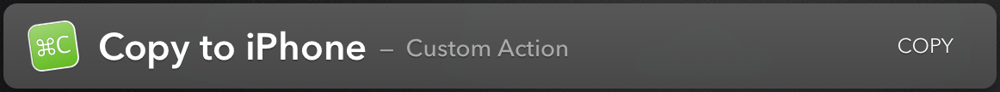
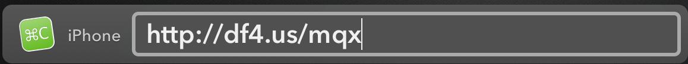
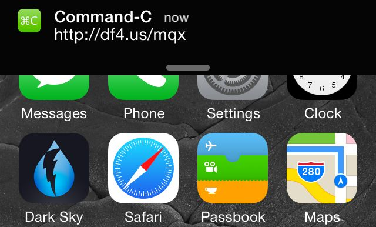
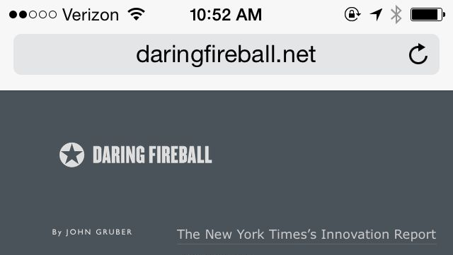

## Copy to iPad

[Signed Copy to iPad.lbaction](https://dl.dropboxusercontent.com/u/1094926/lbdist/Copy%20to%20iPad.lbaction)

Action that uses the [Command-C](http://danilo.to/command-c) application to send either the text or files selected in LaunchBar or your system clipboard to your iPad. Requires that you have [Command-C](http://danilo.to/command-c) installed on your Mac and your iPad.

Note: if you don't use 'iPad' as the device name for your iPad in [Command-C](http://danilo.to/command-c) then after running this action once go to `~/Library/Application Support/LaunchBar/Action Support/com.renaghan.launchbar.CopyToIPad/Preferences.plist` and adjust the setting to match your preferred name

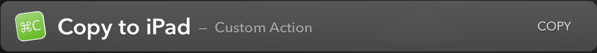
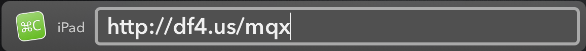
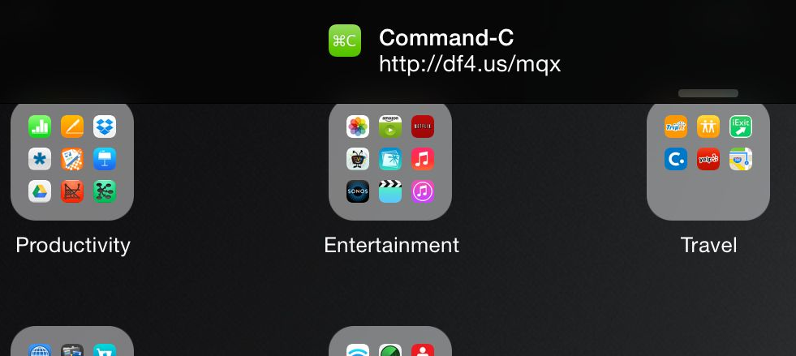
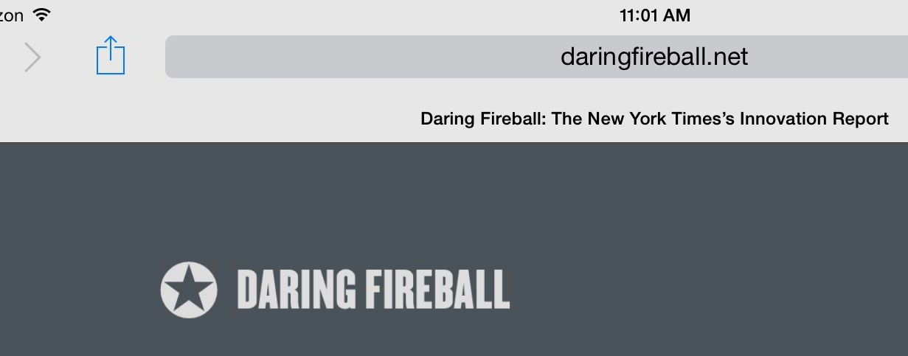

## Share Safari Link

[Signed Share Safari Link.lbaction](https://dl.dropboxusercontent.com/u/1094926/lbdist/Share%20Safari%20Link.lbaction)

Action that gets the Title and URL of the currently selected tab in Safari and returns it back to LaunchBar for further sendTo processing. Making it easy to send a link to the current Safari page via email for example, or by using the Copy to iPhone action.

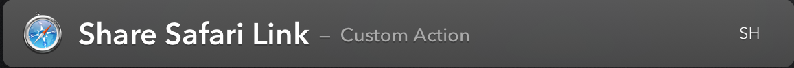
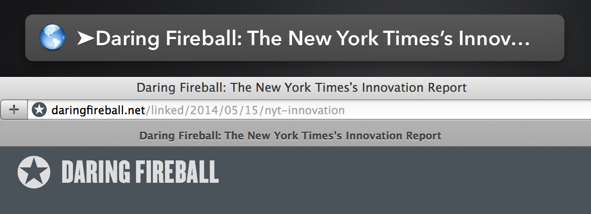

## Timer

[Signed Timer.lbaction](https://dl.dropboxusercontent.com/u/1094926/lbdist/Timer.lbaction)

Action that takes an input like "Turn off oven 15m" and creates a timer in 
LaunchBar. After the delay time has passed LaunchBar will show you your reminder
message in a large type window with an accompanying sound.

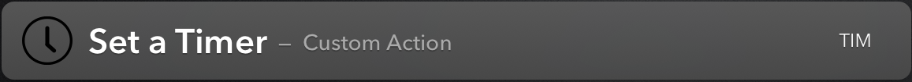
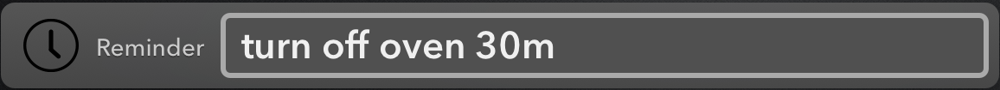


## Ack Code Search

[Signed Ack.lbaction](https://dl.dropboxusercontent.com/u/1094926/lbdist/Ack.lbaction)

Action that takes a text search pattern and uses [Ack](http://beyondgrep.com) to search code files for that pattern and return the results back to LaunchBar.
Make sure you have Ack [installed](http://beyondgrep.com/install/index.html)

Run the action once to generate the default preferences. Then adjust the action preferences in `~/Library/Application Support/LaunchBar/Action Support/com.renaghan.launchbar.Ack/Preferences.plist`
Note that dir can be one directory or a space separated list of directories.
I prefer filenames reversed in the output, disable that by setting the `output` key to `forward`.

For example, my action preferences file looks like:

```xml
<?xml version="1.0" encoding="UTF-8"?>
<!DOCTYPE plist PUBLIC "-//Apple//DTD PLIST 1.0//EN" "http://www.apple.com/DTDs/PropertyList-1.0.dtd">
<plist version="1.0">
<dict>
	<key>ack</key>
	<string>/usr/local/bin/ack</string>
	<key>args</key>
	<string>--max-count=1 --smart-case --ignore-dir=bin --ignore-dir=lib --ignore-dir=test 
	--ignore-dir=logs --ignore-dir=.idea --ignore-dir=.settings --type-add=xml:ext:xsd,wsdl 
	--java --xml --jsp --css --html --js --shell</string>
	<key>dir</key>
	<string>/Users/prenagha/Dev/proj1</string>
	<key>output</key>
	<string>reverse</string>
</dict>
</plist>
```

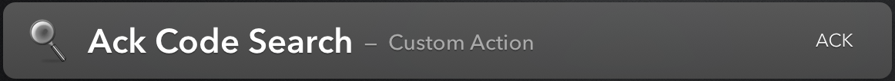
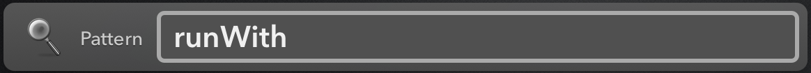
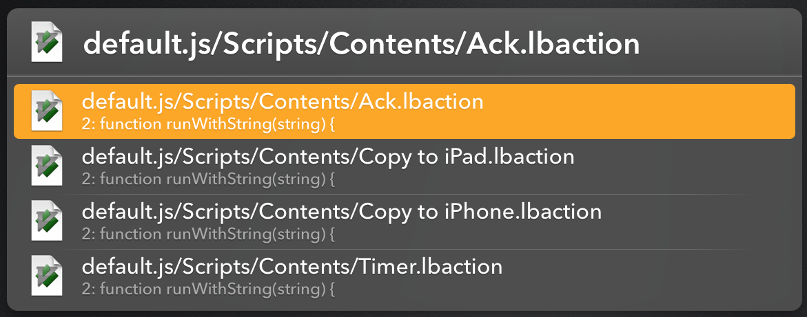

## Read News FeedWrangler

[Signed Feedwrangler.lbaction](https://dl.dropboxusercontent.com/u/1094926/lbdist/Feedwrangler.lbaction)

Action that lets you easily read unread items from [FeedWrangler](http://feedwrangler.net) and either View, Star, Read Later, or Mark as Read. Additionally a "Mark All Read" function is available. Download and install the action. Then run the first time and it will inform you that you need to update the action preferences. Edit the preferences file `~/Library/Application Support/LaunchBar/Action Support/com.renaghan.launchbar.FeedWrangler/Preferences.plist` and set the email, password, and clientKey elements. Get a FeedWrangler client key from [here](https://feedwrangler.net/developers/clients). Re-run the action, it will
authorize with FeedWrangler getting an access token, then it will blank out your
password in the preferences file.

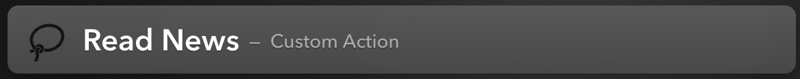
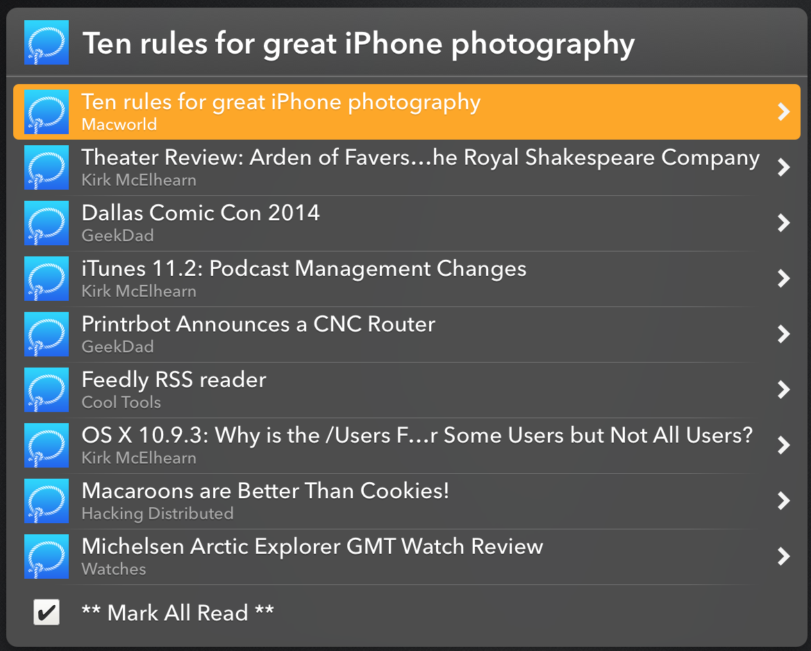
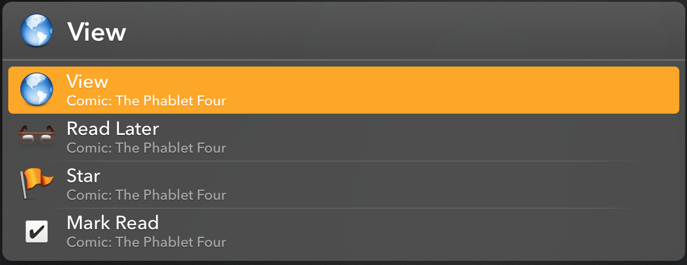

## Generate Password

[Signed Generate Password.lbaction](https://dl.dropboxusercontent.com/u/1094926/lbdist/Generate%20Password.lbaction)

Action that generates a random 12 character password with at least one number and one special character and avoids numbers/letters that look similar to the eye.

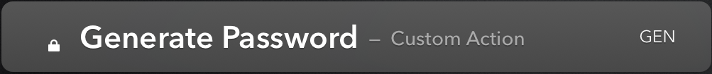

## Expand URL

[Signed Expand URL.lbaction](https://dl.dropboxusercontent.com/u/1094926/lbdist/Expand%20URL.lbaction)

Action that takes a string URL as input and expands it by resolving all redirects and returning the final result URL back to LaunchBar. Useful for 
resolving t.co and bit.ly ... type "short" URLs into real URLs.

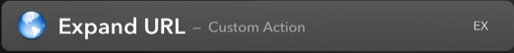
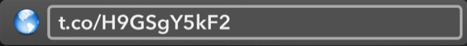
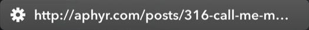

## Screenshot

[Signed Screenshot.lbaction](https://dl.dropboxusercontent.com/u/1094926/lbdist/Screenshot.lbaction)

Capture a screenshot by initiating selection capture, save to ~/Downloads, 
optimize using [ImageAlpha](http://pngmini.com) if present (saving original
as well), and send resulting screenshot file back to LaunchBar so it can
be used in further action chains.

## Caffeinate

[Signed Caffeinate.lbaction](https://dl.dropboxusercontent.com/u/1094926/lbdist/Caffeinate.lbaction)

Keep your system awake using built-in `/usr/bin/caffeinate`. Give the action a string argument in the form of "2h" or "45m" or simply "2" (default in hours) to set the caffeinate/awake duration. Type enter without an argument on the action to see current caffeinate status and the option to stop the current caffeintation.

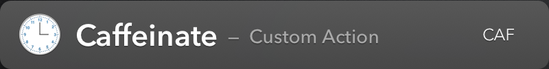

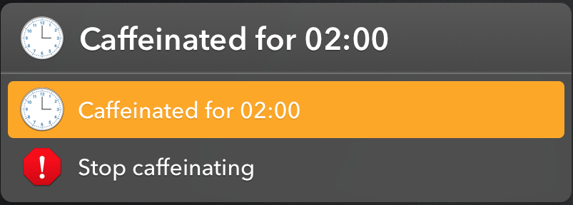

## Forecast

[Signed Forecast.lbaction](https://dl.dropboxusercontent.com/u/1094926/lbdist/Forecast.lbaction)

Custom action that displays weather forecast for a location using forecast data from [forecast.io](http://forecast.io)
* Weather warnings/watches alerts
* Now, Next Hour, Today, and Week forecasts
* Sunrise, Sunset, High, Low, Wind, Precipitation
* Manage multiple locations
* Magic, "Follow Me", location shows location for wherever you are
* Custom name and icons for locations
* Support for [US, metric, Canada, and UK](https://developer.forecast.io/docs/v2) units, °F and °C
* Support for [ISO](https://en.wikipedia.org/wiki/ISO_3166-1_alpha-2) country based location search
* Limited non-English language support currently, but if anyone is interested in translating fully into a [Forecast language (German, French, Spanish, Dutch, Tetum)](https://developer.forecast.io/docs/v2) let me know and I will localize if you can provide the translation

__Installation:__

* Signup for a free [forecast.io developer account](https://developer.forecast.io) and have your API ready
* Install free [Location Helper for Applescript](http://www.mousedown.net/mouseware/LocationHelper.html) app from
Mac App Store
* Install the action by double clicking on the `Forecast.lbaction` file
* Run the action by typing `Forecast` in LaunchBar, then hit space to
enter a location search query, or hit enter and follow the Locations item
to find and use your current location
* Navigate to Locations -- Settings within the action to set
  * Forecast Units
  * Forecast Language
  * Location Search Country


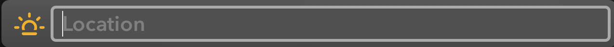
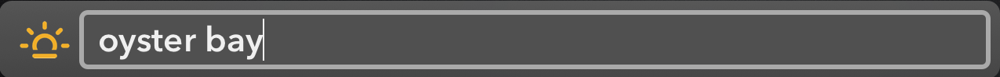
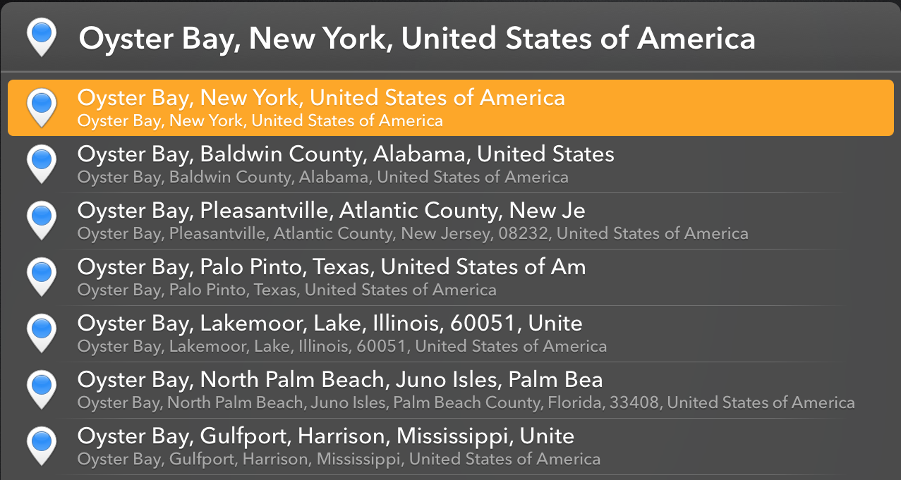
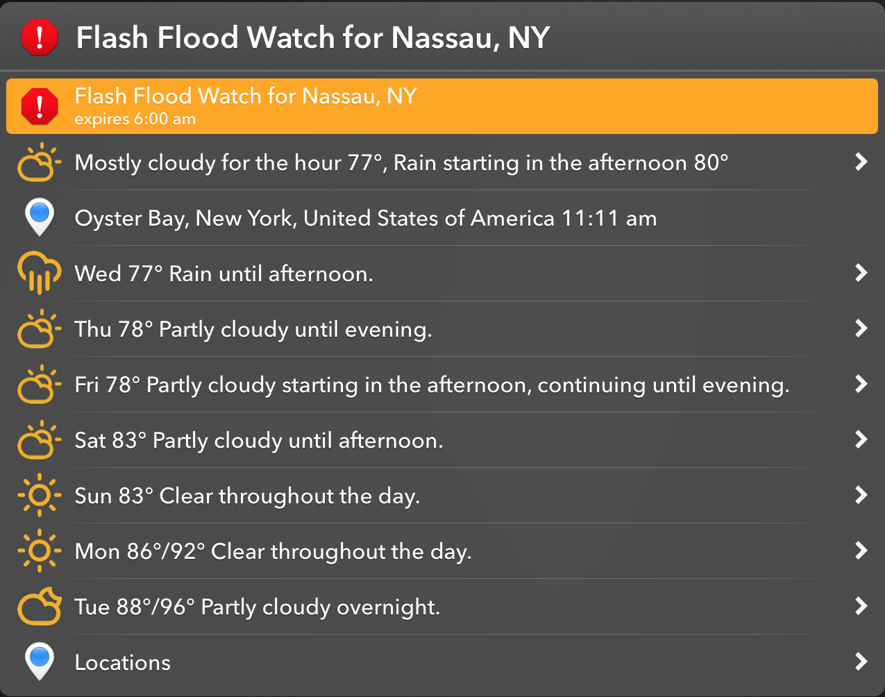
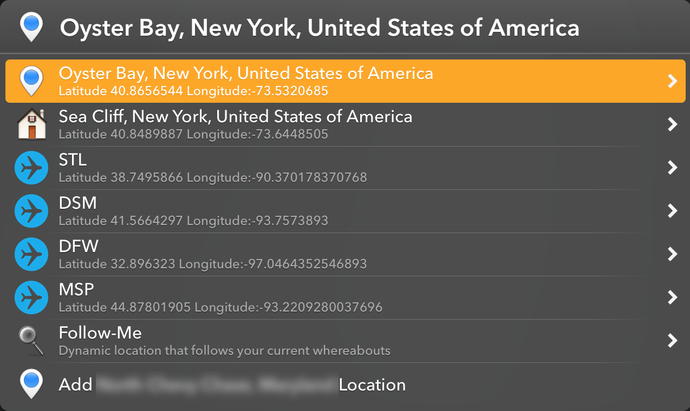
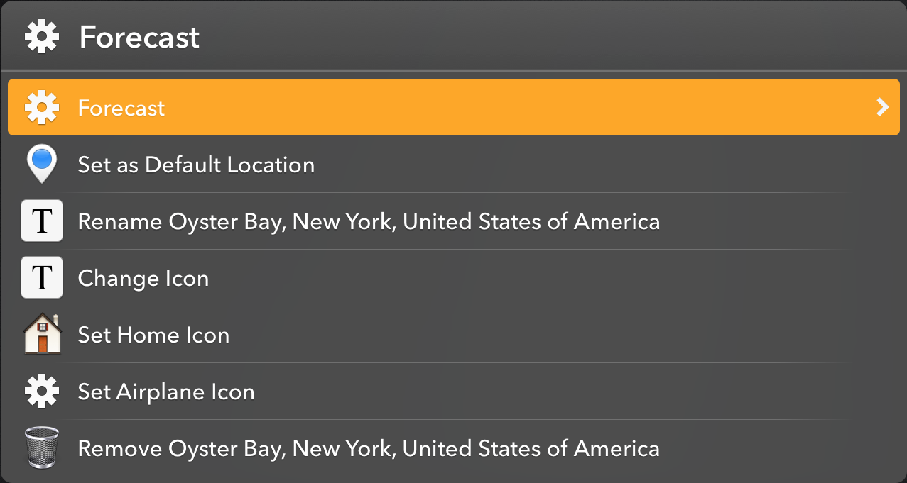
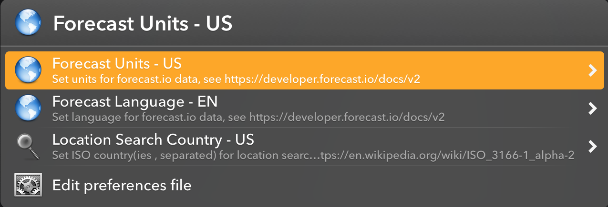

__Thanks to:__

* Forecast data from [forecast.io](http://forecast.io). Makers of the great
[Dark Sky](http://darkskyapp.com) iOS application.
* Images from [Climacons](http://adamwhitcroft.com/climacons/) 
* SVG to PNG image conversion and color change with [ImageMagick](http://www.imagemagick.org)
`mogrify -path ../PNG -transparent white -fill "#F2AF00" -opaque black -density 800 -format png *.svg`
* [Pixelmator](http://www.pixelmator.com) to trim canvas of image transparent background
* [Location Helper for Applescript](http://www.mousedown.net/mouseware/LocationHelper.html), free in
Mac App Store, to find your current location
* [moment.js](http://momentjs.com) and [moment-timezone.js](http://momentjs.com/timezone/) for timezone handling. __NEVER__ try and do this yourself, you will __NOT__ get it right
* [Rounded World Flag Icons](http://kampongboy92.deviantart.com) from kampongboy92
* Forecast action idea originally from [hlissner](https://github.com/hlissner/lb6-actions/tree/master/actions/Forecast.lbaction)


## MailMate

Implementation of LaunchBar's mail API for MailMate application. Install by going to LaunchBar setting, Actions, Options, and point "Create emails with" to this script.

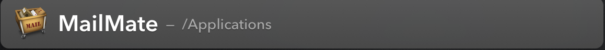
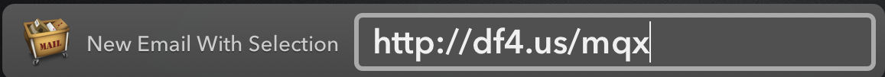
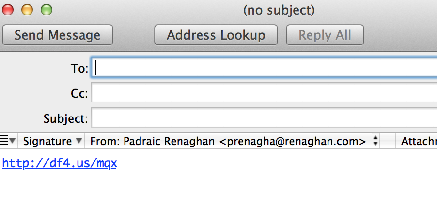

