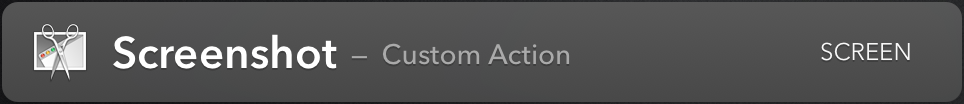
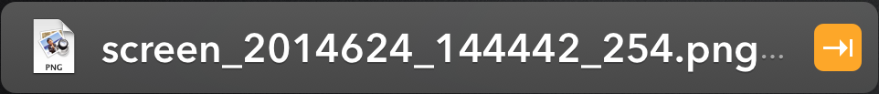

# LaunchBar Actions

Requires at least [LaunchBar](http://www.obdev.at/products/launchbar/index.html) [Version 6 Beta 5](http://www.obdev.at/products/launchbar-beta/)

To install any of these actions
* click the [Download ZIP](https://github.com/prenagha/launchbar/archive/master.zip) button on [Github](https://github.com/prenagha/launchbar)
* unzip the downloaded file
* double-click the `.lbaction` file for the action that you want to install
* LaunchBar will show you basic information about the action and ask you to confirm the installation

## Copy to iPhone

Action that uses the [Command-C](http://danilo.to/command-c) application to send either the text or files selected in LaunchBar or your system clipboard to your iPhone. Requires that you have [Command-C](http://danilo.to/command-c) installed on your Mac and your iPhone.

Note: if you don't use 'iPhone' as the device name for your phone in [Command-C](http://danilo.to/command-c) then after running this action once go to `~/Library/Application Support/LaunchBar/Action Support/com.renaghan.launchbar.CopyToIPhone/Preferences.plist` and adjust the setting to match your preferred name


## Copy to iPad

Action that uses the [Command-C](http://danilo.to/command-c) application to send either the text or files selected in LaunchBar or your system clipboard to your iPad. Requires that you have [Command-C](http://danilo.to/command-c) installed on your Mac and your iPad.

Note: if you don't use 'iPad' as the device name for your iPad in [Command-C](http://danilo.to/command-c) then after running this action once go to `~/Library/Application Support/LaunchBar/Action Support/com.renaghan.launchbar.CopyToIPad/Preferences.plist` and adjust the setting to match your preferred name


## Share Safari Link

Action that gets the Title and URL of the currently selected tab in Safari and returns it back to LaunchBar for further sendTo processing. Making it easy to send a link to the current Safari page via email for example, or by using the Copy to iPhone action.


## Timer

Action that takes an input like "Turn off oven 15m" and creates a timer in 
LaunchBar. After the delay time has passed LaunchBar will show you your reminder
message in a large type window with an accompanying sound.


## Ack Code Search

Action that takes a text search pattern and uses [Ack](http://beyondgrep.com) to search code files for that pattern and return the results back to LaunchBar.
Make sure you have Ack [installed](http://beyondgrep.com/install/index.html)

Run the action once to generate the default preferences. Then adjust the action preferences in `~/Library/Application Support/LaunchBar/Action Support/com.renaghan.launchbar.Ack/Preferences.plist`
Note that dir can be one directory or a space separated list of directories.
I prefer filenames reversed in the output, disable that by setting the `output` key to `forward`.

For example, my action preferences file looks like:

```xml
<?xml version="1.0" encoding="UTF-8"?>
<!DOCTYPE plist PUBLIC "-//Apple//DTD PLIST 1.0//EN" "http://www.apple.com/DTDs/PropertyList-1.0.dtd">
<plist version="1.0">
<dict>
	<key>ack</key>
	<string>/usr/local/bin/ack</string>
	<key>args</key>
	<string>--max-count=1 --smart-case --ignore-dir=bin --ignore-dir=lib --ignore-dir=test 
	--ignore-dir=logs --ignore-dir=.idea --ignore-dir=.settings --type-add=xml:ext:xsd,wsdl 
	--java --xml --jsp --css --html --js --shell</string>
	<key>dir</key>
	<string>/Users/prenagha/Dev/proj1</string>
	<key>output</key>
	<string>reverse</string>
</dict>
</plist>
```


## Read News FeedWrangler

Action that lets you easily read unread items from [FeedWrangler](http://feedwrangler.net) and either View, Star, Read Later, or Mark as Read. Additionally a "Mark All Read" function is available. Download and install the action. Then run the first time and it will inform you that you need to update the action preferences. Edit the preferences file `~/Library/Application Support/LaunchBar/Action Support/com.renaghan.launchbar.FeedWrangler/Preferences.plist` and set the email, password, and clientKey elements. Get a FeedWrangler client key from [here](https://feedwrangler.net/developers/clients). Re-run the action, it will
authorize with FeedWrangler getting an access token, then it will blank out your
password in the preferences file.


## Generate Password

Action that generates a random 12 character password with at least one number and one special character and avoids numbers/letters that look similar to the eye.


## Expand URL

Action that takes a string URL as input and expands it by resolving all redirects and returning the final result URL back to LaunchBar. Useful for 
resolving t.co and bit.ly ... type "short" URLs into real URLs.


## Screenshot

Capture a screenshot by initiating selection capture, save to ~/Downloads, 
optimize using [ImageAlpha](http://pngmini.com) if present (saving original
as well), and send resulting screenshot file back to LaunchBar so it can
be used in further action chains.




## MailMate

Implementation of LaunchBar's mail API for MailMate application. Install by going to LaunchBar setting, Actions, Options, and point "Create emails with" to this script.


